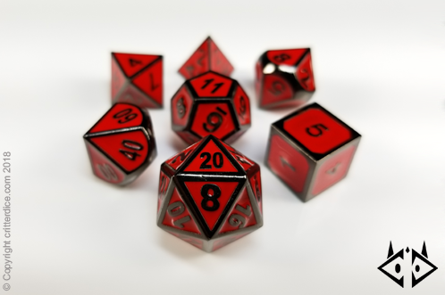

# Exercise - D & D Digital Dice

If you've ever played D&D (Dungeons and Dragons), you'll love this challenge. If you have never played D&D then you'll still love this challenge but you must submit to the Glory of my 20th level, Epic Devil-Skin-Drow Wizard named Whygg Oodwy.


D&D is a game where you will need to roll a variety of dice. In this challenge you are writing code to represent a physical object, namely a die. 

Making a class is making a factory to produce objects. When I say `object`, I'm refering to a coding concept that represents a series of attributes and behaviors. 

- You could think of an attribute as what an object is such as how many `sides` a die has. 
- You could think of a behavoir as what an object can do (behavoirs) such as a die can `roll`.

> An attribute can also refer to the current state of an object, aka. what the object is at a given moment in time. ex: which side is currently facing up.


We will start with a basic `Die` class which can be initialized with any number of sides.  We then want to roll the die, returning a random integer.

# Commit 0 - Research

Look through your notes on making classes if you need to review.

If you need to dive further into Object Oriented Programming, might I suggest the very popular book, [Practical Object Oriented Design in Ruby](http://www.poodr.com/) also known as POODR.

# Commit 1 - Psuedocode

You should write psuedo code for each method, some of these will be very short as far as steps on some methods.

- List the methods that you want to write. Hint: You know of at least three - `sides` (reader), `roll` and `initialize`
- What data do you need to run each method. This may not be an argument passed in to the method it may be stored in an instance variable, but it's important to note that the data will be needed to run your logic with in the method.
- What data type do you expect to get out of your roll method (is it a string, integer, array, hash, bolean, etc.) or does it change an attribute but there is no expected return value?
- Write out the steps for each method in your class in plain english.

# Commit 2 - Initial Solution

Start by writing your class with an `Die#initialize` method. Set up your attributes as instance variables and then write your other methods.

# Commit 3 - Write Runner Code / Tests

Example:

```ruby
noraml_die = Die.new(6)
noraml_die.sides # returns 6
noraml_die.roll # returns a random integer, 1 - 6
```

# Commit 4 - Make A Bag of Dice

In D&D you would normally take multiple dice and throw them at once. 

Example: 

- 4 - six sided die
- 1 - twenty sided die
- 2 - eight sided die
- 2 or 3 - four sided die. 

Is there a way to write a method outside of your 'Die' class that would take assorted number of dice of various sides and roll them all at once? Could you make another method for a throw that references the `Die` class? The best way to do this is a second class called `DiceCup` that "is a collection of dice". Note: the subtle hint, how do you define what an object is?

Write runner code for all the dice in your D&D collection. 4 sided, 6 sided, 8 sided and/or 20 sided. Make a couple dynamic examples.



# Bonus 1 - Add A Custom Error

When we initialize `Die.new` with a number less than `1`, we should raise an `ArgumentError`.  This is done using the `raise` keyword, you saw a rspec test in the last instruction.  See the [ArgumentError documentation](http://apidock.com/ruby/ArgumentError) for details on how to impliment this. This will help your user use your code the way it is intended.

- [Short Description Custom Errors](http://blog.honeybadger.io/ruby-custom-exceptions/) 
- [Long Description Custom Errors](https://rubymonk.com/learning/books/4-ruby-primer-ascent/chapters/41-exceptions/lessons/91-tidying-things-up)

# Bonus 2 - Build Yatzee

This is a Big Bonus but you can do it if you have the time.

Build a Yahtzee game in terminal. Make another class called `Game` that allows you to start a game, keep trace of your score sheet, document scores, roll all the dice in your cup, hold certain dice and reroll, check if a roll is accepted etc. The rules are [Here](https://www.wikihow.com/Play-Yahtzee). I recommend that you start with only one player first.

