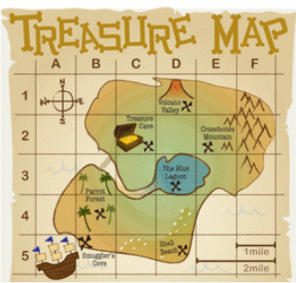

# Exercise - East Egg Hunt


That old floppy-eared friend has come to town once more and he's littered your yard with eggs. We'll be writing some code to pick up the bright-colored-and-hard-boiled debris so your yard doesn't stink next week.

Your yard map is represented by a nested array, like this .

(example a)

```ruby
yard = [["G","E","G"],
        ["G","G","G"],
        ["E","G","G"]]
```

### Goals
- Write a `clean_yard` method calling smaller methods. 
- Your yard map should be 14 spaces wide and 11 spaces top to bottom.
- Find the eggs represented by an "E" string
- Collect the eggs into the `basket` variable
- Keep track of the coordinates of each egg.
- Replace the torn up yard divots where the eggs have been with a replacement patch of grass represented by a string of “G"
- Print the yard to see updates as eggs are being collected.

You get to decide where the eggs go in your yard, but an example would be something like this.

<pre>
G  G  G  G  G  G  G  G  E  G  G  E  G  E
G  G  E  G  G  G  G  G  G  E  G  G  G  G
G  G  G  G  G  E  G  E  G  G  G  G  G  G
G  G  G  E  G  G  G  G  G  G  G  G  G  G
G  E  G  G  G  G  G  G  G  G  G  G  G  G
G  G  G  G  G  G  G  E  G  G  G  G  E  G
G  G  G  G  G  G  G  G  G  G  G  G  E  G
G  G  G  G  E  G  G  G  G  G  G  G  G  G
G  G  E  G  G  G  G  G  G  E  G  G  G  G
G  G  G  G  E  G  G  G  G  G  G  G  G  E
G  G  G  G  G  G  G  G  G  G  G  E  G  G
</pre>

When you’re done, you’ll want to print a report to the terminal that the yard is clean and “up to code" with the homeowner association along with a count of the found eggs. This will also help us make sure we didn't miss a hard to find egg.

You should expect a report similar to this, pay attention to spacing for a clean report.

```
*************** Yard Report ***************

  Yard: Clean
  Divots: Replaced

  Total Eggs Found: 13

  Eggs found at the following coordinates
  ---------------------------------------
             col: 0  - row: 8
             col: 0  - row: 11
             col: 0  - row: 13
             col: 1  - row: 2
             col: 1  - row: 9
             col: 2  - row: 5
             col: 2  - row: 7
             col: 3  - row: 3
             col: 4  - row: 1
             col: 5  - row: 7
             col: 5  - row: 12
             col: 6  - row: 12
             col: 7  - row: 4
             col: 8  - row: 2
             col: 8  - row: 9
             col: 9  - row: 4
             col: 9  - row: 13
             col: 10 - row: 11

  Sir or Madam, 
  Your Yard is safe for Horseshoe,
  BBQ's, Beanbag-toss and the like. 
  See you next year, Rabbit.

*******************************************

```

<br>

# Commit 0 - Research

### Nested Arrays as a Grid



Looking at our "example a" above, we can think about the nested array as a map. There is an x coordinate finding a column (side to side) and a y coordinate finding a row (up and down). Our coordniates start in the top left corner of the map.

```ruby
puts yard[0][1] #=> "E"
puts yard[2][1] #=> "G"
```

Use this concept of map coordniates to collect data and effect your yard. Note: do not use `flatten` on the yard as that will destroy your coordniate system.

### Attractive Report

You get to decide the format of the report. Look at string methods on [ruby-doc.org](https://ruby-doc.org/core-2.4.0/String.html) to create a user friendly report.

- I recommend `ljust`, `center`, `rjust` to start with.
- What does this code do? `puts "*" * 8`
- What does this code do? `puts ""`

# Commit 1 - Psuedocode

How will you loop through a nested array? Be very specific.

Write down your steps to generate your report and replace the divets.

# Commit 2 - Write Runner Code

Create your yard as a nested array in a variable and pass it into your `clean_yard` method.

# Commit 3 - Initial Solution

Create an initial solution for the `clean_yard` method.

Note: use `p` statements in your code to help with debugging. `puts` for user friendly printing.

# Commit 4 - Refactor Solution

Copy and paste your initial code in the `Refactor Solution` section and clean it up.

# Bonus

Make your eggs colored with this [example](examples/colorized_example.rb)

