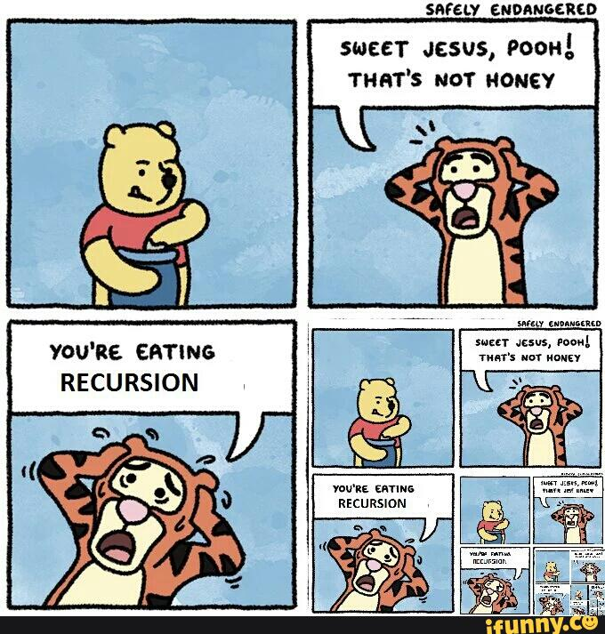
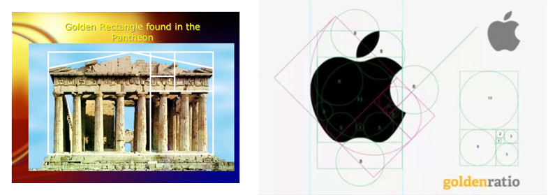
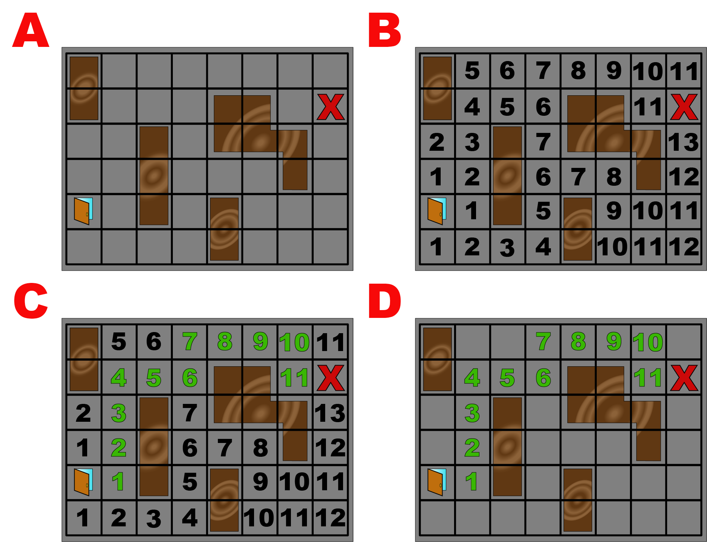

# Exercise - Recursion

Recursion is when you call a method inside itself.



# Commit 0 - Research

## Iteration vs Recursion

- Iteration is a loop such as `Array#each`, `Integer#times`, a `while` loop, or an `until` loop, etc.
- Recursion is calling a block (method) inside itself until a condition (base case) is met.

At it's core, any problem that can be solved with recursion can also be solved using iteration. We will look at some of the differences as we go through this exercise.

For the next example, you need to know how to find a factorial. A factorial of a number is the product of that number and all numbers down to 1 multiplied together. 

Factorial of 5:

```ruby
5 * 4 * 3 * 2 * 1 #= the factorial of 5 is 120
```

We can write a method that solves the problem iteratively, e.g. with a loop.

```ruby
def factorial(number)
  product = 1

  until number <= 1 # similar to a base case, telling our loop to stop
    product *= number
    number -= 1
  end
  
  product
end
```

...or we can write the solution recursively, e.g. calling the method inside itself.

```ruby
def factorial(number)
  return 1 if number <= 1 # base case
  number * factorial(number - 1) # calling the method inside itself
end
```

###### Things to Note

- The code is a little cleaner although that is not always the case with recursion. Nor is it the sole reason for choosing one option over the other.
- The number is being decremented and then passed into the factorial method again.
- The base case is overlooked every time except the last time the recursion occurs.
- Without a base case, this would never stop running.

1. Recursion must always run the method inside itself.
2. Recursion must have a piece of data that changes passed into the next recursion.
3. Recursion must have a base case to stop.
 

Look closer at the logic, use this code to print out the product building up as the method repeats.

```ruby
def factorial(number)
  print number
  return 1 if number <= 1 # base case
  print " * "
  number * factorial(number - 1) # calling the method inside itself
end

puts " = #{factorial(5)}"
```
or visually see how the code unfolds

```
             # The code unfolds down          # Then it rolls back up after hitting the base case
factorial(5) = 5 * factorial(4)               # factorial(4) is equal to 4 * factorial(3) or 4 * 3 * 2 * 1
factorial(5) = 5 * 4 * factorial(3)           # factorial(3) is equal to 3 * factorial(2) or 3 * 2 * 1
factorial(5) = 5 * 4 * 3 * factorial(2)       # factorial(2) is equal to 2 * factorial(1) or 2 * 1
factorial(5) = 5 * 4 * 3 * 2 * factorial(1)   # factorial(1) is equal to 1 (base case triggered)
factorial(5) = 5 * 4 * 3 * 2 * 1                
factorial(5) = 120
```

##### Recursion Notes

- Recursion needs a base case
 - A "base case" is the brake that stops your recursion. If you do not have a base case you enter an infinite loop until you run out of memory. The amount of memory is allotted for the program in the "call stack" which acts as a buffer, storing requests that need to be handled. If your program tries to use more memory addresses than the stack has available, you get a Stack Overflow (where the help site gets its name). A stack overflow can crash your program or your computer so be careful. In the current version of ruby, it usually crashes the program and gives a `stack level too deep (SystemStackError)`. When you see this error, check your base case.
- Ruby prefers iteration over recursion most of the time. There are scenarios where it is the preferred way to solve a problem in ruby. It is, therefore, a vital tool to become familiar with.
- Some other programming languages don't have iteration and you must use recursion.

##### Additional Resources on Recursion

- [Recursion Reading](http://ruby.bastardsbook.com/chapters/recursion/) from The Bastard Book of Ruby by Dan Nguyen. Describes recursion in a beautiful way. He views recursion as a division of labor. Look at `The King and His Rocks` if you want to dive in further. This is not necassary to complete the exercise.
- [Recursion Watching](https://vimeo.com/24716767) - basic introduction to recursion by Joshua Cheek if you need a review told by another person.

## Default Arguments

If you want to pass in a default argument, give the parameter a value when you define it. 

Run this example:

```ruby
def soft_cheese(type,age=8)
   "#{type}, aged #{age} months"
end

parmesan = soft_cheese("paramesan") # only passing in the first argument, uses the default for the second argument
blue_cheese = soft_cheese("blue", 3) # passing a second argument, overrides the default value

puts parmesan
puts blue_cheese
```

# Commit 1 - Iterative Fibonacci Sequence

The [Fibonacci Sequence](https://www.mathsisfun.com/numbers/fibonacci-sequence.html) is a series of numbers, where each number is the sum of the previous two numbers, starting with 0 and 1. It is used to find the Golden Spiral or the Golden Ratio which designers have used for millennia.



Complete the `fibonacci_iterative` method using iteration to solve the problem.

# Commit 2 - Recursive Fibonacci Sequence

Complete the `fibonacci_recursive` method using recursion to solve the problem.

# Commit 3 - Benchmark

Take a quick glance at the documentation on the [Benchmark Module](https://ruby-doc.org/stdlib-2.5.0/libdoc/benchmark/rdoc/Benchmark.html). This is used to compare how fast methods take to run. Part of the speed is effected by outside events such as other programs running, how much memory is being used, etc. Shut down other programs that are not being used and run it a couple times to get an accurate report.

To run Benchmark...

- Comment out your runner code.
- Uncomment the require line and benchmark lines to compare how fast each method runs.

# Bonus - Recursive Escape Room

The bonus is charting the quickest way out of "The Room" with out falling into the quicksand. You are entering through a door on the left and must exit through the red X on the right in the smallest number of steps.

	A - In a new file, model a Room using a nested array/nested hash.
	B - Use recursion to find how far each square is from the starting space.
	C - Then choose the shortest path.
	D - Highlight the path or get rid of the other options when printing in the terminal.




